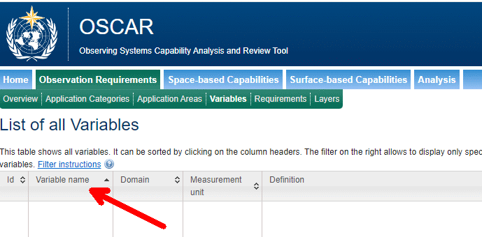
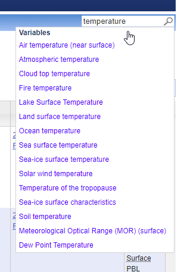
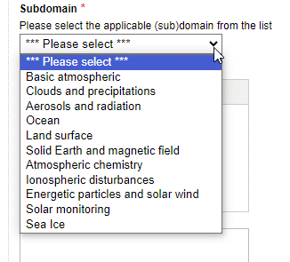
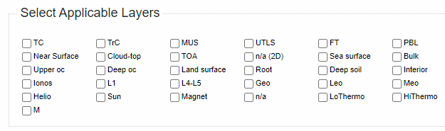
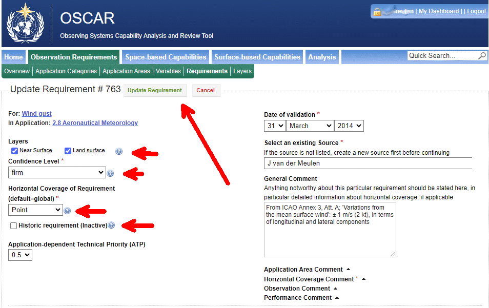
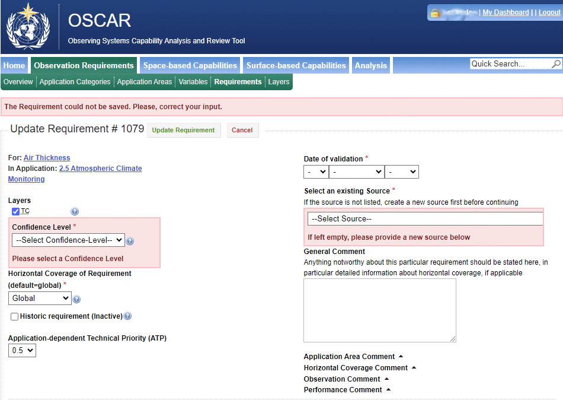
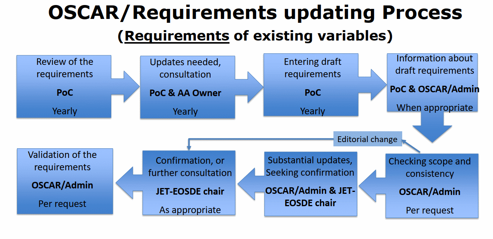

.. cookbook.rst file for OSCAR Requirements PoC Manual

.. _cookbook:

============================
Introduction to the Cookbook
============================

Purpose 
-------

This cookbook is intended as a (simple) stepwise procedure to help the
PoC and the ESAC Coordinator in modifying the contents of the
OSCAR/Requirements database. The idea behind the cookbook is to provide
the actions to be taken in a sequential manner when the database should
be updated. It is specific for requirements on Variables that are
required within particular Application Areas.

Before using this cookbook it is strongly recommended to study the other
items first to become familiar with OSCAR/requirements, the structure of
the database and also the developments behind its structure. In case of
questions, hesitancy, doubt or ambiguity you may contact WMO by `e-mail 
<contact_>`_. Before contacting WMO it is recommended to check the
FAQ section and the help pages on OSCAR/requirement.

It is also recommended to notice and study reference material provided
in the :ref:`References <references>` section. In particular, the 
document indicated with `INFCOM-2/INF. 6.1(3) (2022) <INF06-1-3-local_>`_, 
Requirements for Observational Data in the
Framework of the WMO Earth System Approach: The Rolling Review of
Requirements” and its Annexes and Attachments is valuable.

.. _STEP1:

Step 1: “Be prepared”
---------------------

Before you begin (and login) first investigate the present status of the
database (DB). Not only your Application Area (AA) should be considered
but also the requirements for the set of variables you are involved
with. Comparing the requirements and choice of variables for the other
AAs may help you to prepare the editing activities.

As explained in the item Structure under Variables there are rules for
introducing new variables. The basic rules are

-  Avoid redundancy between equivalent variables

-  Adopt a unique designation for a given physical variable

-  Select elementary variables describing basic physical properties of
   the environment rather than complex variables that can be derived
   from other variables

-  Physical variables should be defined in a “technology free” manner
   and do not necessarily correspond with the output of a particular
   instrument.

It will also help if for each variable to be selected or modified, a
complete overview is drafted with all items to be entered. So, not only
the six basic requirements (Uncertainty, Horizontal resolution, Vertical
resolution, Observing cycle, Timeliness and Stability). It is important
to be able to enter an appropriate (background) reference in the Source
field. This reference acts as information to support the requirements.

It is good practice to check first the status of all variables for your
Application Area (AA). This should be done in two ways:

1. Select in Observation Requirements the tab Application Areas. You
   will see a detailed overview and description of your Application Area
   together with a list of variables, grouped in various domains. You
   may wish to select one of the variables, but it is sometimes more
   convenient to follow the route as explained in the other way:

2. Select in Observation Requirements the tab Variables. You will see
   the full and extensive list of all variables, used in all domains and
   all Application Areas. Then you should select a specific set of
   variables using >> Filter table (see figure, with arrow right and
   explanation using “Filter instructions”, arrow left)

|figureC01|

After opening the Filter table, you will see an overview with many
selectable items. You may select e.g. the Application Area “Aeronautical
Meteorology”:

|figureC02|

At the bottom of this overview, you may Close this window without
implementing the filter or start filtering by clicking on Refresh Table:

|figureC03|

After selecting (or deselecting) the items and clicking on Refresh Table
you will get a new (filtered) overview with only these variables that
confirm the selecting criteria (in this example all variables associated
with Aeronautical Meteorology). If you wish you may select additional
items in the Filter Table to reduce the selection. In practice this
method is most convenient to check the present status.

After you have checked the present status of the variables within your
AA and want to add another or new variable to the set of variables the
following practice is most adequate in this preparatory phase.

1. If not done already, select in Observation Requirements the tab
   Variables. If items are selected in the Filter Table as explained
   above, deselect all these items and click on Refresh Table. You will
   see now all variables, defined in OSCAR/requirements, even those that
   are not linked to any AA (many!).

2. You may scroll first through the full list of variables (more than
   350 entries). In most cases it is convenient to sort first on the
   Variable name (click on Variable name, see arrow):

   |figureC04|

3. To speed up this process, a quick search may help to find a specific
   variable. To find that variable click on the Quick Search area, on
   the top right (see arrow), and enter (a part of) the name of that
   variable (e.g. temperature or humidity):

   |figureC05|

   |figureC06|

   |figureC07|

   You will see all variables with the entered name in it and you may
   select one of these.

.. Note::
   
   You will get only the variables associated with the entered
   name. If you select for instance humidity (see example above) you
   will not get dewpoint temperature. So, it is advised to search for
   all possible names.

.. admonition:: Editing mode versus operational mode 

   Be aware that you will be editing in a test or editing
   environment. After acceptance of your modifications by the
   OSCAR/Requirements Administrator and further review and confirmation the
   changes will be implemented in the operational OSCAR/Requirements
   database (see :ref:`Step 5 <STEP5>`)`

.. _STEP2:

Step 2: Login
-------------

WMO secretariat should has provided you with a username and password
(UN/PW). UN/PW are private and should be shared. To login you should
open the `OSCAR website <oscar-web_>`_ on your browser and
then select the “Observation Requirements” tab. Selecting this tab will
prevent login in in other OSCAR environments. On the top right you will
find “login”:

|figureC08|

The next webpage asks you for your username and password (UN/PW):

|figureC09|

Enter the UN/PW in these field and click on the “Login” button. If
successful you will get the following webpage:

|figureC10|

On top to the right (arrow 1) you will see your username indicating that
you are logged in successfully. There you can logout as well and to
switch back to this entry point (My Dashboard) in case you are lost in
the many web pages of OSCAR.

In the area on the right side, you will find personal details. Check
these items and update the items using (arrow 2) Update my personal
Data, where you can change tour password as well.

On the left side you may start to create a new variable or add a new
requirement to a variable (arrow 3), just by clicking these buttons. But
in most cases (for PoCs) it is better practice to go to the requirements
section by clicking the Observations Requirements tab (arrow 4) and go
to Step 3. This approach is more convenient because from the requirement
pages an overview is provided of the already defined variables and their
requirements

Nevertheless, if you want to create quickly a new variable or add a new
requirement you may select Add Variable or Add Requirement (3). However,
these links are also provided on the Variables and Requirements web
pages (see step 3 and step 4)

The other items, as shown bottom left (below arrow 3) are specific for
the maintenance of core OSCAR/Requirements items to be carried out by
the OSCAR/Requirements Administrators, so **not to be edited by PoCs**:

|figureC11|

However, the item Manage Requirements in Draft Status will be useful
later on to control the status of your modifications (see :ref:`step
5 <STEP5>`) 

.. _STEP3:

Step 3: "Select variables” to see what variables are available
--------------------------------------------------------------

After login in you see the My Dashboard webpage (see step 2). From this
page you should select the Observations Requirements tab offering other
tabs (Overview, Application Categories, Application Areas, Variables,
Requirements, Layers). It is recommended to select first the Variables
tab and later Requirements (see Step 4). Like in Step 1 you will see the
full list of variables and you may select a specific set by using the
Filter table (as explained in :ref:`Step 1 <STEP1>`). If you want to modify one of the
variables associated to your AA than it is useful to select your AA in
this Filter table. This List of all Variables may look like:

|figureC12|

Important notice: Be aware that these data are from the test (or
editing) database and some may not have been confirmed yet. So, these
data may differ from the data in the operational DB (that you will see
if you are not logged in, see Step 1).

Typically for this editing environment is that you will see additional
entries to be clicked on, e.g. Add new variable (see arrow 1), a pencil
(|pencil| for editing) and e red bullet (|delete| for deleting), see
arrow 2. Please be very carefully not to delete a variable from this
list, unless you are very sure to do so. Editing (clicking on the
pencil) will edit the variable in general (definition, units), not the
items uniquely related to your AA. Therefore, editing the variable may
only be done only if you are allowed to do so. If you click on it
accidentally you can click on Cancel and will return to the variables
page for this specific variable (select the Variables tab to obtain the
Full List again).

.. admonition:: Important!

   |EDIT-icon| \  \  \  \   |DELETE-icon|

   Be very careful with the use of the edit (pencil) and delete buttons

The area in the column “Required for App” lists all Application Areas
the variable is associated with (see arrow 3). In case this variable is
associated with your AA, then your AA is shown here as well.

It is strongly recommended to add an existing variable only to the set
associated with your AA. That is because redundancy between equivalent
variables must be avoided. So, don’t select Add new variable (arrow 1)
if there is already a variable that is defined and shown in the overall
list.

Also, only elementary variables must be defined, describing basic
physical properties of the environment rather than complex variables
that can be derived from other variables. A good example of an
incorrectly added variable is Relative Humidity. This variable is in
fact a secondary type of variable based on two primary variables, Air
Specific Humidity and Air Temperature. Instead of relative humidity, Air
Specific Humidity should be chosen.

Anyway, if a brand-new variable must be created you may click on Add new
variable and will get:

|figureC13|

In the area left you enter the new variable name. If applicable you can
tick in (of leave open) the items “Applied in OSCAR/Space Gap Analysis”,
and the theme tags Cryosphere or Volcanoes. A subdomain must be selected
from its list:

|figureC14|

.. Note::
   
   By selecting a sub-domain, the domain itself is selected
   automatically (see for an overview of domains and sub-domains the item
   Structure (Domains, Layers and Coverages) in this manual and and this
   `weblink <domain-web_>`_.

Subsequently an appropriate definition shall be given (or copied from
the WMO Vocabulary). Note that physical variables should be defined in a
“technology free” manner and do not necessarily correspond with the
output of a particular instrument. Furthermore, it is useful to enter
comments that will help users to understand the meaning of this
variable. Note that is not always trivial for a user what that meaning
is.

In the area right on this page you enter the units, directly associated
to the variable (Measuring Units, Uncertainty Unit, Stability Unit).
These units must be SI units (mandatory, see Manual on the WIGOS,
WMO-No. 1160). It is strongly recommended to use the same units for
these three fields. In some cases, a variable may not be associated to
any unit although it is recommended to indicate units as far as possible
(like mg/kg). In those cases, one may enter “dimensionless” (e.g. for
numbers) or “%” (percentage, e.g. for cloud coverage). It is allowed to
choose for relative uncertainty in which case the percentage sign (%)
may be entered. Note that a facility is provided to enter subscripts and
superscripts and also special symbols like omega (Ω) and micro (µ).
Subsequently the units for Horizontal and Vertical Resolution (a
distance) must be entered (preferably km, m or cm).

.. note::

   SI stands for The International System of Units , published in
   the `SI Brochure <SI-brochure_>`_, issued by the `Bureau international des poids et mesures/
   International Bureau of Weights and Measures <BIPM-SI-web_>`_ (BIPM)

Finally, the specific applicable (vertical) layers associated with this
variable must be entered. Under the item Structure (Domains, Layers and
Coverages) in this manual the structure of the vertical layers as part
of the domains and sub-domains is explained. This structure should be
well considered when selecting the applicable layers. In case a variable
will not be associated with any layer (no altitude dependence) then n/a
(not applicable) or n/a (2D) (not applicable for 2D fields) can be
selected (for the Cross-cutting domain). See for further explanation of
the layers the information, provided in the tab Layers (to open this tab
without losing the data already entered in Create New Variable, right
click the tab Layers and select Open link in a new tab.) So, click one
or more from the following list:

|figureC15|

Example for the variable “Atmospheric temperature” with 7 layers within
the sub-domain Basic atmospheric:

|figureC16|

Finally you will get something like in this example:

|figureC17|

If all details are entered and complete you can save this new variable
by clicking on the green button Create Variable on top of this page.
Clicking on the red button Cancel will close this page without saving
the details:

|figureC18|

*Example of a created new variable (Air Thickness)*

In almost all situations an existing variable can be chosen from the
List of all variables. Also, in many cases you will only modify or add
specific information to the variables already selected in the past for
your AA. For all these cases this Variables webpage is in fact
informative only. Editing the AA related requirements items for the
selected variables is done in step 4 on the webpage for Requirements.

Note: if you have chosen for a variable that is available in the List of
all Variables, but the details (e.g. units, domain, layers) to not
confirm to your specifications or are incorrect, you should contact your
contact within the WMO secretariat (or via `e-mail <contact_>`_).

.. _STEP4:

Step 4: “Select requirements” and select available variable to be introduced for the AA
---------------------------------------------------------------------------------------

There may be two specific reasons to edit requirements:

1. For one or more specific variables within the set of variables of
   your AA, some data must be modified or added. So, an update of the
   present situation.

2. A new or existing variable must be added tot the set of variables of
   your AA. So, a new variable chosen or created as explained in Step 3

In both cases you should open the Requirements webpage, by clicking on
the Requirements tab. You will get:

|figureC19|

Note that you will see the full width of this webpage, just only a
number of the columns at left. To see the columns on the right, you have
to scroll down within your browser window to the bottom (or by using the
ruler, see arrow 1). At the bottom you will find a horizontal ruler
(arrow 3) you can use by moving rightwards. If successful you can scroll
up again to the top and see the other columns op to Performance Comment.
To find the variable you like to modify you should use the inner ruler
indicated by arrow 2.

|figureC20|

[1] Modify and add data to an already existing variable
~~~~~~~~~~~~~~~~~~~~~~~~~~~~~~~~~~~~~~~~~~~~~~~~~~~~~~~

To modify a variable that is already within the set associated to your
AA, you should find that specific variable. It is most convenient to
first filter out the variables that are not associated with your AA.
This can be done by clicking on the Filter table facility (top right, as
explained in Step 1) and select your AA and then click on green button
Refresh table. Subsequently scroll to the variable (in the example
below, Wind gust for Aeronautical Meteorology, with Req Id #763):

|figureC21|

Note: Alternatively, if you don’t like to use the Filter facility, you
can use the Quick Search facility (top right) by entering (a part of)
the name of the variable (e.g. wind) and then select that variable from
the offered list (e.g. Wind gust, see Step 1).

In the red circle shown in the figure above, you will see four clickable
entries:

   1. The name of the variable

   2. The Requirements Id number (not the Variable Id as shown on the
      Variables page)

   3. A pencil for an editing activity

   4. A red button to delete the whole requirement.

Clicking on the variable name will give the overview as shown in Step 3,
so with general information and the associated AA’s, not the specific
requirements. Clicking on the Requirements Id number will give the
overview associated to this specific requirement.

Editing this present requirement can be done by clicking on the pencil
(also within the Requirement Id page). You will see an editing page with
all details entered so far:

|figureC22|

On top two important buttons are shown: (in green) Update Requirement
and (in red) Cancel (see arrow). The cancel button can be used in case
of mistakes (all editing is lost), the Update Requirement button is to
save the modifications and to close this page.

In the provided text you will see many buttons with question marks (?),
see small arrows. Clicking on these explanatory buttons will open
dedicated text areas with detailed information on that topic:

|figureC23|

On the right side of this page, you will see some metadata information
and the comment fields. To open (or close) the comment fields you must
click on it.

On the bottom of the page, you will see the editable fields with data to
be modified (or to be filled in). Notice the question mark button
providing helpful explanations of the various definitions.

|figureC24|

After editing and checking you should save the result by clicking on the
green button on top, Update Requirement. A green banner will indicate a
successful update.

[2] Creating a new requirement for a new or added variable
~~~~~~~~~~~~~~~~~~~~~~~~~~~~~~~~~~~~~~~~~~~~~~~~~~~~~~~~~~

In case a new variable must be added to the set associated to your AA
then the link on top with Add new Requirement shall be used:

|figureC25|

Clicking on this link will give the following webpage where you select:

   1. A variable from the list of all variables, inclusive newly created in
      Step 3

   2. An Application Area (AA)

You can select a variable (see arrow 1) or AA (see arrow 2)by clicking
and selecting, but you may also type in a name and then continue to
choose the correct items:

|figureC26|

After selecting the appropriate variable and AA you should click on the
green button Create Requirement in which case new Requirement Id number
is generated and a new web page is opened (e.g. Update Requirement #
1079) and a green banner is shown on top indicating that the new
requirement was created. However, if you click on the red button Cancel
the creation of a new requirement is cancelled. In case you created a
new requirement the new webpage will look identical to the page when
editing an existing requirement (see above, Modify and add data to an
already existing variable). In this case however, you have to fill in
many open fields although many fields are already filled with default
values and should be adjusted.

After editing and checking you should save the result by clicking on the
green button on top, Update Requirement. Clicking on the red button
Cancel will exit this update action, keep the requirement as it is.
Deleting the requirement can be done using the red (Delete) button in
front of the requirement itself in the Requirement webpage (a green
banner indicating that the requirement is successfully deleted will be
shown on top).

If you finalize the Update Requirement webpage but omit to enter
mandatory filled in you will get an error message in return saying that
the requirement could not be saved and request to correct the input:

|figureC27|

In case of a successful update, you will see a green banner on top
indicating that the requirement has been updated:

|figureC28|

After modifying or creating requirements it is good practice to control
all edited items before you logout. If checked and accepted, you may
logout (see top right).

.. _STEP5:

Step 5: Follow up after updating
--------------------------------

It is useful to inform by e-mail your contact at the WMO secretariat or
using obs-rrr@wmo.int that modifications were carried out so the
OSCAR/Requirement Administrator can continue with the confirmation
process.

The procedure on how the update is processed and finally confirmed for
modification in the public database is shown below. As explained in Step
3 and Step 4 to types modifications are in practice ([1] modification
and creation of requirements and [2] creating new variables):

|figureC29|

|figureC30|

Both processes will take time (may be more than a year). During this
interval you may check the status by login and by opening the item
Manage Requirements in Draft in your Dashboard (the webpage you get
after login).

|
|

----------------------------------------------------------

:ref:`Goto top <cookbook>`

----------------------------------------------------------

:Version: |version| (|today|)

:editor: `JPM`

:update: `2024-08-31 22:17 CEST`

:status: `TEST`

.. cookbook internal links and hyperlinks

.. _contact: obs-rrr@wmo.int 

.. _domain-web: https://space.oscar.wmo.int/domains   

.. _oscar-web: https://space.oscar.wmo.int/

.. _INF06-1-3-local: _static/INFCOM-2-INF06-1(3)-OBSERVATIONAL-DATA-EARTH-SYSTEM-RRR_en.pdf

.. _INF06-1-3-web: https://meetings.wmo.int/INFCOM-2/_layouts/15/WopiFrame.aspx?sourcedoc={52B2ADCA-4EF9-43A7-BB34-543A9ABBF088}&file=INFCOM-2-INF06-1(3)-OBSERVATIONAL-DATA-EARTH-SYSTEM-RRR_en.docx&action=default

.. _SI-brochure: https://www.bipm.org/documents/20126/41483022/SI-Brochure-9.pdf

.. _BIPM-SI-web: https://www.bipm.org/en/publications/si-brochure

.. cookbook figures

.. |figureC01| image:: _static/fig-coo-01.gif
   :scale: 60%

.. vv :width: 1144px
   :height: 438px

.. |figureC02| image:: _static/fig-coo-02.gif
   :width: 445px
   :height: 267px

.. vv    :width: 689px
   :height: 340px

.. |figureC05| image:: _static/fig-coo-05.gif
   :width: 288px
   :height: 289px

.. |figureC07| image:: _static/fig-coo-07.gif
   :width: 245px
   :height: 173px

.. |figureC08| image:: _static/fig-coo-08.gif
   :scale: 70%

.. vv    :width: 963px
   :height: 197px

.. |figureC09| image:: _static/fig-coo-09.gif
   :scale: 70%

.. vv    :width: 959px
   :height: 534px

.. vv    :width: 957px
   :height: 748px

.. |figureC12| image:: _static/fig-coo-12.gif
   :scale: 60%

.. vv    :width: 1139px
   :height: 496px

.. |figureC13| image:: _static/fig-coo-13.gif
   :scale: 70%

.. vv    :width: 966px
   :height: 871px

.. |figureC16| image:: _static/fig-coo-16.gif
   :width: 268px
   :height: 258px

.. |figureC17| image:: _static/fig-coo-17.gif
   :scale: 66%

.. vv    :width: 1007px
   :height: 845px

.. |figureC18| image:: _static/fig-coo-18.gif
   :scale: 66%

.. vv    :width: 953px
   :height: 737px

.. vv    :width: 1388px
   :height: 523px

.. |figureC20| image:: _static/fig-coo-20.gif
   :scale: 60%

.. vv    :width: 1208px
   :height: 557px

.. vv    :width: 638px
   :height: 485px

.. vv    :width: 954px
   :height: 601px

.. |figureC23| image:: _static/fig-coo-23.gif
   :width: 388px
   :height: 496px

.. |figureC24| image:: _static/fig-coo-24.gif
   :scale: 80%

.. vv    :width: 954px
   :height: 586px

.. |figureC26| image:: _static/fig-coo-26.gif
   :scale: 90%

.. vv    :width: 723px
   :height: 665px

.. vv    :width: 950px
   :height: 674px

.. |figureC28| image:: _static/fig-coo-28.gif
   :scale: 70%

.. vv    :width: 950px
   :height: 403px

.. vv    :width: 1276px
   :height: 619px

.. |figureC30| image:: _static/fig-coo-30.gif
   :scale: 55%

.. vv    :width: 1274px
   :height: 582px

.. |delete| image:: _static/delete.png
   :width: 16px
   :height: 16px

.. |pencil| image:: _static/pencil.png
   :width: 16px
   :height: 16px

.. |DELETE-icon| image:: _static/DELETE\ icon.gif
   :width: 72px
   :height: 21px

.. |EDIT-icon| image:: _static/EDIT\ icon.gif
   :width: 54px
   :height: 21px

.. end

